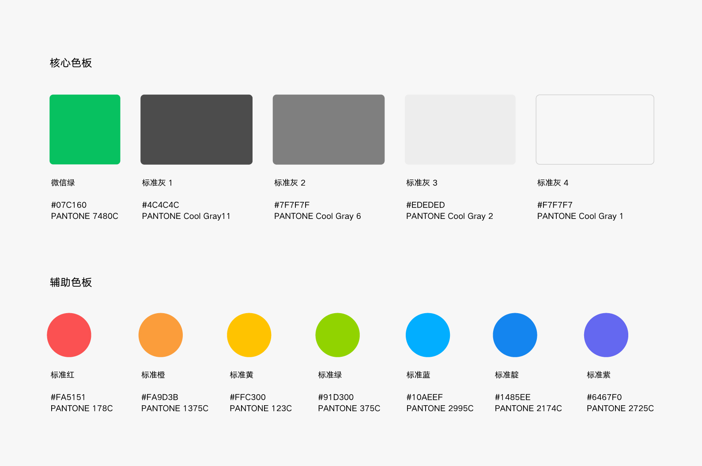
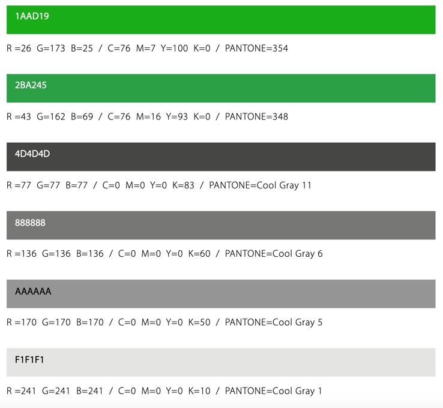
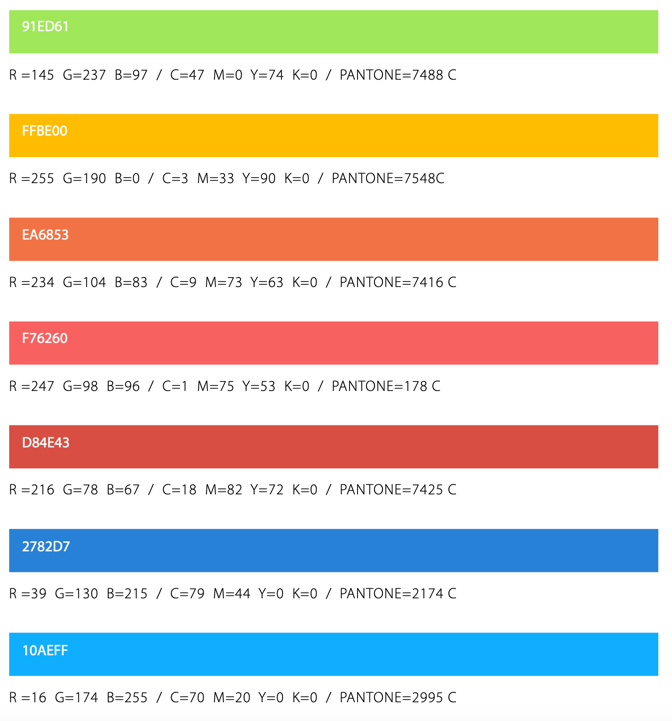

# CSS 变量

### 色彩

色彩是品牌传播的重要元素，设计中对色彩的运用首要应考虑到品牌层面的表达，另外很重要的是色彩的运用应达到信息传递、动作指引、交互反馈或是强化和凸显某个元素。任何颜色的选取和使用都应该是有意义的。

<div class="van-doc-image">

</div>

```less

    --weui-FG: #000;
    --weui-BG: #fff;
    --weui-BRAND: #07c160;

    --weui-RED: #fa5151;
    --weui-ORANGE: #fa9d3b;
    --weui-YELLOW: #ffc300;
    --weui-GREEN: #91d300;
    --weui-LIGHTGREEN: #95ec69;
    --weui-BLUE: #10aeff;
    --weui-INDIGO: #1485ee;
    --weui-PURPLE: #6467f0;
    --weui-WHITE: #fff;
```

## 色板

### 核心色板

“黑白灰”色系作为常用背景色；“微信绿”色系作为小面积点缀的品牌色，微信品牌核心色板给出不同模式的色值，线上请使用RGB色值；线下请使用 PANTONE 色值和CMYK 色值，请勿自行使用颜色转换工具转换色值。

<div class="van-doc-image">

</div>

### 辅助色板
微信色彩系统提供可搭配核心色板使用的辅助色板，该色板由绿、黄、红、蓝构成并
与微信核心色板组成完整的品牌色环，为设计提供更多的可能性。线上线下资源的设
计请遵循微信品牌色彩系统。

<div class="van-doc-image">

</div>


## 产品级色彩体系

### 品牌色

品牌色是体现产品特性和传播理念最直观的视觉元素之一。在色彩选取时，需要先明确品牌色在界面中的使用场景及范围。

WeUI 取自微信的品牌色 - 绿色，Hex 值为 #07c160，应用场景包括：
- 关键行动点，
- 操作状态、
- 重要信息高亮，
- 图形化等场景。

```less

    --weui-BRAND: #07c160;
```

### 功能色

功能色代表了明确的信息以及状态，比如成功、出错、失败、提醒、链接等。

功能色的选取需要遵守用户对色彩的基本认知。我们建议在一套产品体系下，功能色尽量保持一致，不要有过多的自定义干扰用户的认知体验。

```less
--weui-LINK: #576b95;
--weui-RED: #fa5151;
@weuiBtnFontColor: #fff;
@weuiColorWarn: var(--weui-RED);

@weuiBtnPrimaryFontColor: @weuiBtnFontColor;
@weuiBtnPrimaryDisabledFontColor: @weuiBtnDisabledFontColor;
@weuiBtnPrimaryBg: var(--weui-BRAND);
@weuiBtnPrimaryActiveBg: var(--weui-TAG-TEXT-GREEN);
@weuiBtnPrimaryDisabledBg: @weuiBtnDisabledBg;

@weuiBtnWarnFontColor: @weuiColorWarn;

@weuiBtnDefaultBg: var(--weui-BTN-DEFAULT-BG);
@weuiBtnDefaultActiveBg: var(--weui-BTN-DEFAULT-ACTIVE-BG);
```

### 中性色

中性色主要被大量的应用在界面的文字部分，此外背景、边框、分割线等场景中也非常常见。

产品中性色的定义需要考虑深色背景以及浅色背景的差异，同时结合 WCAG 2.0 标准。

```css

    --weui-BG-0: #ededed;
    --weui-BG-1: #f7f7f7;
    --weui-BG-2: #fff;
    --weui-BG-3: #f7f7f7;
    --weui-BG-4: #4c4c4c;
    --weui-BG-5: #fff;
    --weui-FG-0: rgba(0, 0, 0, 0.9);
    --weui-FG-HALF: rgba(0, 0, 0, 0.9);
    --weui-FG-1: rgba(0, 0, 0, 0.5);
    --weui-FG-2: rgba(0, 0, 0, 0.3);
    --weui-FG-3: rgba(0, 0, 0, 0.1);
    --weui-FG-4: rgba(0, 0, 0, 0.15);

```

## 字体

###
用户通过文本来理解内容和完成工作，科学的字体系统将大大提升用户的阅读体验及工作效率。

在同一个系统的 UI 设计中先建立体系化的设计思路，对主、次、辅助、标题、展示等类别的字体做统一的规划，再落地到具体场景中进行微调。

### 字体家族

优先使用系统默认的界面字体，同时提供了一套利于屏显的备用字体库，来维护在不同平台以及浏览器的显示下，字体始终保持良好的易读性和可读性，体现了友好、稳定和专业的特性。

```less
@weuiFontEN: system-ui, -apple-system, "Helvetica Neue";
@weuiFontCN: "PingFang SC", "Hiragino Sans GB", "Microsoft YaHei";
@weuiFontSans: sans-serif;
@weuiFontDefault: @weuiFontEN, @weuiFontSans;

```

### 主字体

我们基于电脑显示器阅读距离（50 cm）以及最佳阅读角度（0.3），保证在多数常用显示器上的用户阅读效率最佳。

```css
body {
    line-height: 1.6;
    font-family: @weuiFontDefault;
}
```

### 字阶与行高

字阶和行高决定着一套字体系统的动态与秩序之美。字阶是指一系列有规律的不同尺寸的字体。行高可以理解为一个包裹在字体外面的无形的盒子。

### 字重

字重的选择同样基于秩序、稳定、克制的原则。多数情况下，只出现 regular 以及 medium 的两种字体重量，分别对应代码中的 400 和 500。在英文字体加粗的情况下会采用 semibold 的字体重量，对应代码中的 600。

### 字体颜色

文本颜色如果和背景颜色太接近就会难以阅读。考虑到无障碍设计的需求，我们参考了 WCAG 的标准，将正文文本、标题和背景色之间保持在了 7:1 以上的 AAA 级对比度。

