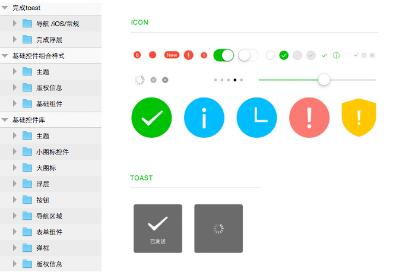
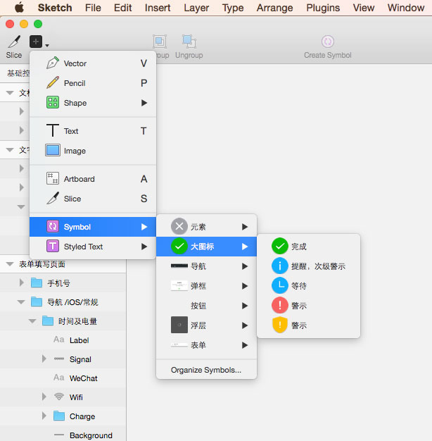

# 设计资源

### 简介

[WeUI](https://github.com/weui/weui) 是一套同微信原生视觉体验一致的基础样式库，由微信官方设计团队为微信内网页和微信小程序量身设计，令用户的使用感知更加统一。

WeUI-Design 是微信官方设计团队设计的一套同微信原生视觉体验一致的基础视觉样式库，目前提供 Sketch 与 PSD 基础样式库源文件。开发者或设计师可以使用 WeUI-Design 进行微信 Web 开发的原型设计、视觉设计等。

### 下载

https://github.com/weui/weui-design

[WeUI-Design.zip](https://github.com/weui/WeUI-Design/archive/master.zip)

### 环境依赖

#### Sketch 版本

建议不低于 v40

#### PhotoShop

建议不低于 CS5

#### 字体

iOS

- 苹方 / PingFang SC（ Mac OS X EI Caption ，版本10 .11及以上系统内置 ）
- SF UI Display（ 需Apple官网下载，地址：https://developer.apple.com/fonts/ ）

Android

- 思源黑体 / NotoSans CJK SC（附件有资源）
- Roboto（附件有资源）

### Sketch 使用说明

#### 方法一

复制粘贴控件图层进行创作

#### 方法二

使用Symbol进行快速创作，可方便的在多个页面和画板中重复运用控件

### PSD 使用说明

下载使用

### 使用须知

WeUI-Design 是微信官方设计团队作品，知识产权等相关权利归腾讯公司所有。使用前，请阅读以下使用须知及法律声明。对于违反使用须知及法律声明的行为，我们将保留法律追究权利。

#### 我们鼓励
- 使用 WeUI-Design 的控件，进行适当地再次加工创作，形成自己的作品

#### 我们禁止
- 未经允许直接利用 WeUI-Design 作品开展牟利行为，包括但不限于打包售卖、另行建立镜像收取费用、有偿下载、积分下载等行为

### 更新

#### 2017-01-19

- 次级警告 icon 由灰色改成黄色

#### 2016-12-27

- symbol支持了resizing 能力
- 更正“弹窗”为模态对话框
- 单独展示操作列表（actionsheet），新增有提醒文案样式
- 新增新消息标识

